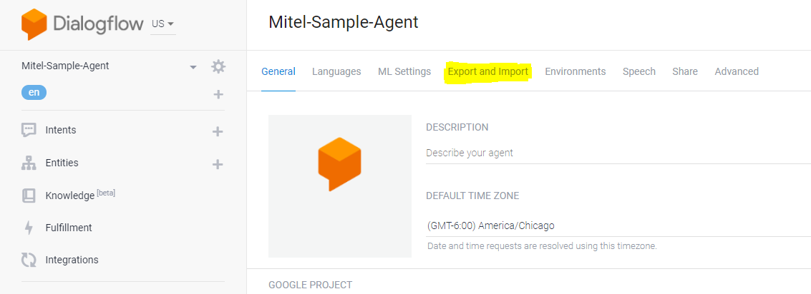

# Dialogflow sample agent

This example provides a Dialogflow agent export (that can be imported using the Dialogflow console), two versions of fulfillment code and examples of how to provide different response types. 

## Importing the agent
The agent used in this example can be found [here](https://github.com/mitel-networks/micc-api-samples/blob/dialogflow-sample/CCAI%20CC%20Messenger/DialogflowExample/agent/Mitel-Sample-Agent.zip)  

Download the zip file and import into Dialogflow (Export and Import -> Restore from Zip)

Some settings will not be restored by the import of the agent, once the import is complete you will need to:  

## The mitel-welcome event
The custom event "mitel-welcome" used at the start of every session and can be used to:
- Provide a customized welcome greeting
- Store data from chat overlay for use in Dialogflow

## Fulfillment
When you enable fulfillment for an intent, Dialogflow responds to that intent by calling a webhook service which must accept a JSON request and provide a JSON response. 
For more information on providing fulfillment see the Google documetation here: [Fulfillment](https://cloud.google.com/dialogflow/docs/fulfillment-overview)

There are many ways to deploy the webhook service, this example provides code that can be used to deploy the service on Google Cloud using either:
- Google App Engine Node.js Standard
- Google Cloud Functions

### Google App Engine

### Google Cloud Functions

## Providing non-text respones from the Dialogflow console
Providing non-text responses from the Dialogflow console can be done using custom payloads and a JSON payload that matches the wanted content type. 
https://github.com/mitel-networks/micc-api-samples/wiki/Message-content-types

## Providing non-text respones from fulfillment
